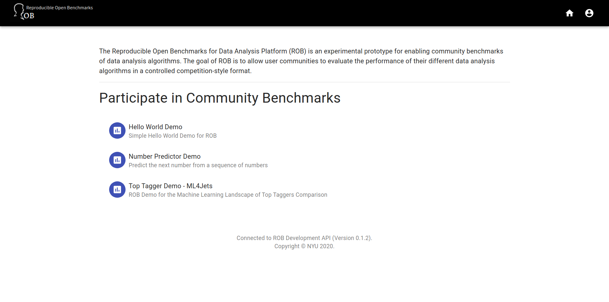

==============================================
Reproducible Open Benchmarks - Top Tagger Demo
==============================================

.. image:: https://img.shields.io/badge/License-MIT-yellow.svg
   :target: https://github.com/scailfin/benchmark-templates/blob/master/LICENSE

About
=====

The **Top Tagger Demo** is part of the `Reproducible Open Benchmarks for Data Analysis Platform (ROB) <https://github.com/scailfin/rob-core>`_. This demo contains part of the code used for the comparison analysis published in  `The Machine Learning Landscape of Top Taggers <https://arxiv.org/abs/1902.09914>`_:

*"Based on the established task of identifying boosted, hadronically decaying top quarks, we compare a wide range of modern machine learning approaches. We find that they are extremely powerful and great fun."*

The majority of the code in this repository has been adopted from the following repositories: `Tree Network in Network (TreeNiN) for Jet Physics <https://github.com/SebastianMacaluso/TreeNiN>`_ and `Top Tagging Comparison Analysis <https://github.com/SebastianMacaluso/TopTagComparison>`_.

Getting Started
===============

The demo requires an instance of the `ROB Web Service <https://github.com/scailfin/rob-webapi-flask/>`_ and the `ROB Command Line Interface <https://github.com/scailfin/rob-client/>`_. You can follow the instructions on the `Flask Web API - Demo Setup site <https://github.com/scailfin/rob-webapi-flask/blob/master/docs/demo-setup.rst>`_ to setup and run the Web API. The `ROB Command Line Interface <https://github.com/scailfin/rob-client/>`_ page contains information to install the client.

Use the ``robadm`` command line client from the Web API to create a new benchmark. Make sure to set the environment variables that configure the database accordingly, e.g.,:

.. code-block:: bash

    export ROB_DBMS=SQLITE3
    export SQLITE_ROB_CONNECT=./.rob/db.sqlite

This demo does not use the default workflow controller. It uses the Docker-based controller instead. To configure the Web API accordingly, set the following environment variables:

.. code-block:: bash

    export ROB_ENGINE_CLASS=DockerWorkflowEngine
    export ROB_ENGINE_MODULE=robcore.controller.backend.docker

.. note:: This demo requires an installed and running Docker daemon.

If the Web API is otherwise running on your local machine with the default settings there is no need to configure additional environment variables. If the Web API is running on a different machine or port, for example, set the environment variables **ROB_API_HOST**, **ROB_API_PORT**, and **ROB_API_PATH** accordingly (see `the documentation <https://github.com/scailfin/rob-core/blob/master/docs/configuration.rst>`_ for details).

Number Predictor Benchmark
--------------------------

The following commands will download the demo and register it as a new benchmark with the local ROB Web Service:

.. code-block:: bash

    git clone https://github.com/scailfin/rob-demo-top-tagger.git
    robadm benchmarks create \
        -n "ML4Jets - Top Tagger Comparison" \
        -d "The Machine Learning Landscape of Top Taggers" \
        -i rob-demo-top-tagger/benchmark/instructions.md \
        -s rob-demo-top-tagger/benchmark/

Run the Benchmark
=================

The repository provides several different implementations for the predictor:

- `max-value.py <https://github.com/scailfin/rob-demo-predictor/blob/master/solutions/max-value.py>`_: Uses the maximum value in a given sequence as the prediction result.
- `max-n-value.py <https://github.com/scailfin/rob-demo-predictor/blob/master/solutions/max-n-value.py>`_: Uses the maximum value in a given sequence and adds a given constant value as the prediction result.
- `last-two-diff.py <https://github.com/scailfin/rob-demo-predictor/blob/master/solutions/last-two-diff.py>`_: Uses the difference between last two values in a given sequence a the prediction result.
- `add-first.py <https://github.com/scailfin/rob-demo-predictor/blob/master/solutions/add-first.py>`_: Uses the sum of the first value and the last value in a given sequence to determine the result.
- `AddDiffOfLastTwoValues.java <https://github.com/scailfin/rob-demo-predictor/blob/master/solutions/java-predictor/src/main/java/org/rob/demo/predictor/AddDiffOfLastTwoValues.java>`_: Implementation of the predictor that uses Java as the programming language instead of Python. Uses the sum of the last value and the difference between the last value and the next-to-last value in a given sequence as the prediction result.

Start by registering a new user **alice**. The create a submission for the *Top Tagger* benchmark.

.. code-block:: bash

    # Register new user
    rob register -u alice -p mypwd
    # Login as alice
    eval $(rob login -u alice -p mypwd)
    # Set predictor benchmark as the default benchmark. Replace *xxxxxxxx*
    # with the actual benchmark identifier
    rob benchmarks list
    export ROB_BENCHMARK=xxxxxxxx
    # Create a new submission for the benchmark. Use the unique identifier of
    # the created submission as the default submission
    eval $(rob submissions create -n 'SimpleNet')

Create a new benchmark run. In this demo all code files are contained in the repository and can be run using the toptaggerdemo:0.1 Docker container image. Use `python code/SimpleNet.py results/processed_test_jets.pkl data/evaluate/ results/` as the command for the ML step (all other template parameters should use the default values).

.. code-block:: bash

    # Start a new run
    rob runs start
    # Check run status
    rob runs list

Once the run completes successful, you can view the current benchmark results.

.. code-block:: bash

    rob benchmarks leaders

Screenshots
===========

ROB Home Screen
---------------

